Arduino setup:
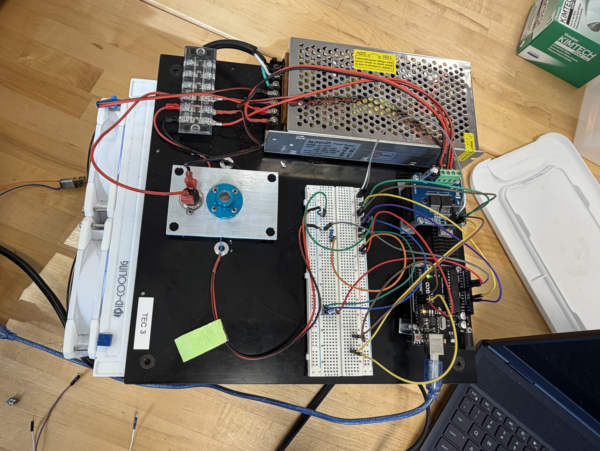
Pin 9 at PWM 0:
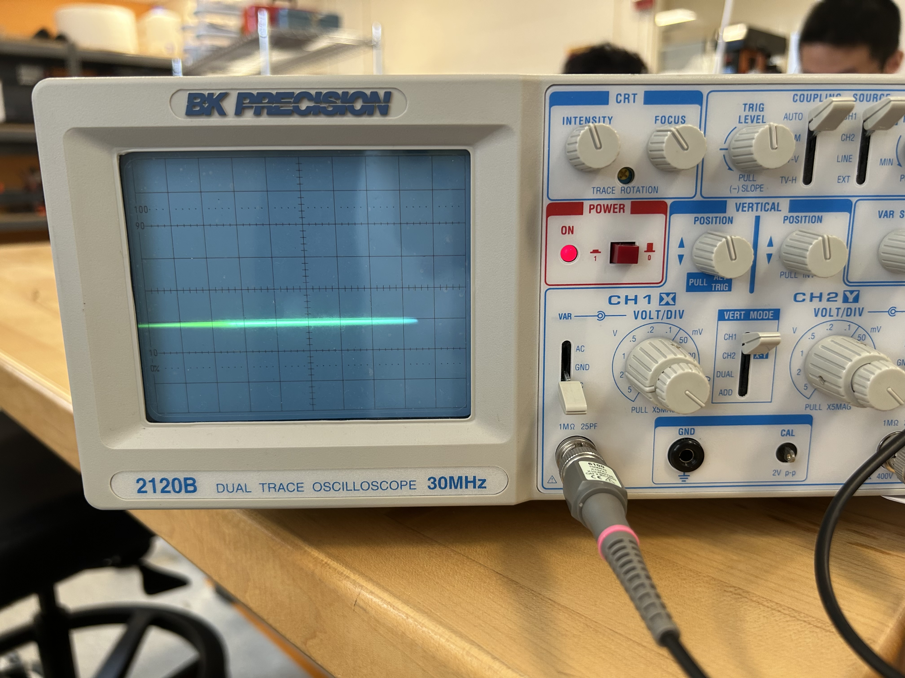
Pin 9 while PWM at 200:
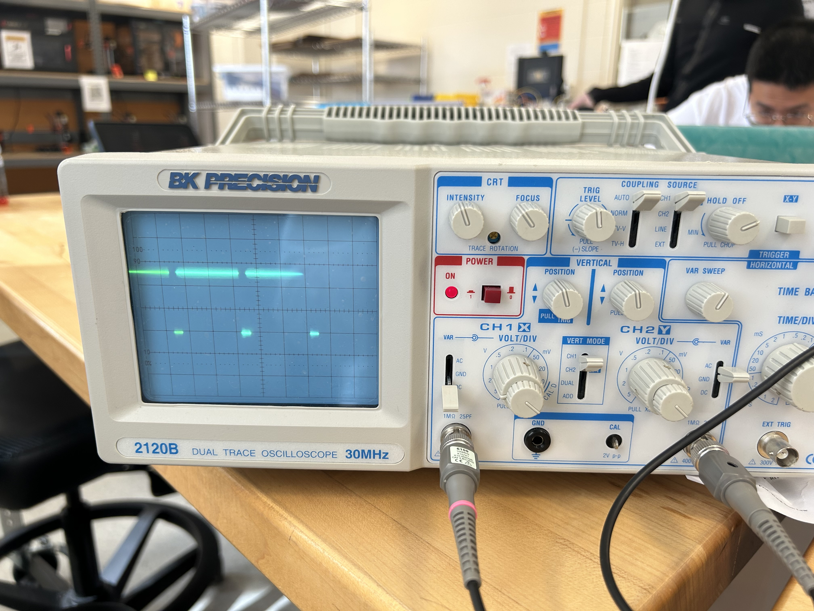
Pin 9 while PWM at 100:
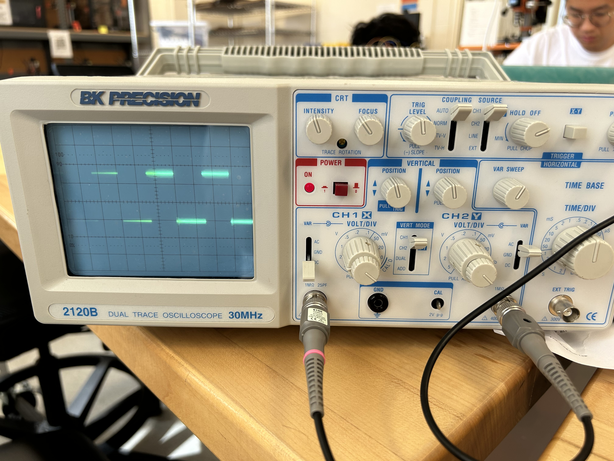
Pin 9 at PWM 121 while Pin 10 is on (ie. Pin 9 off):
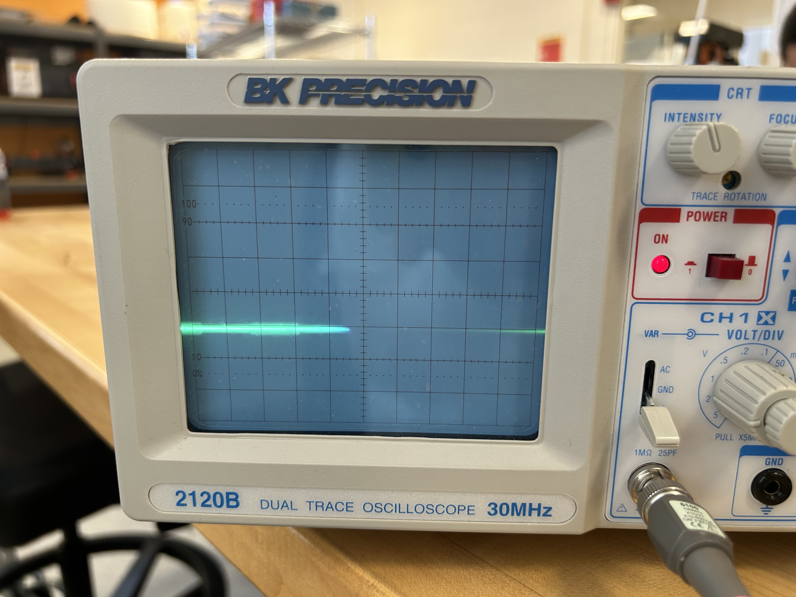
Pin 9 at PWM 121:
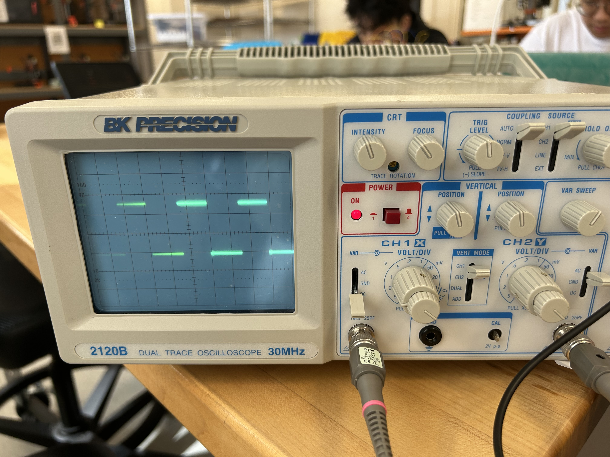
Pin 10 at PWM 229:
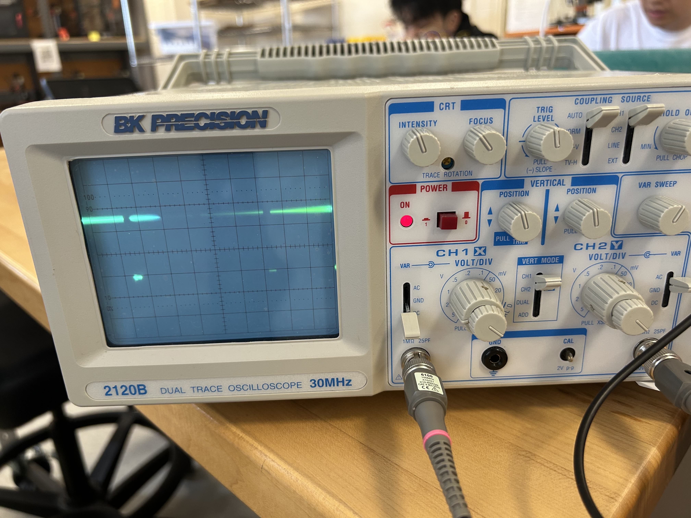
Pin 10 at PWM 72:
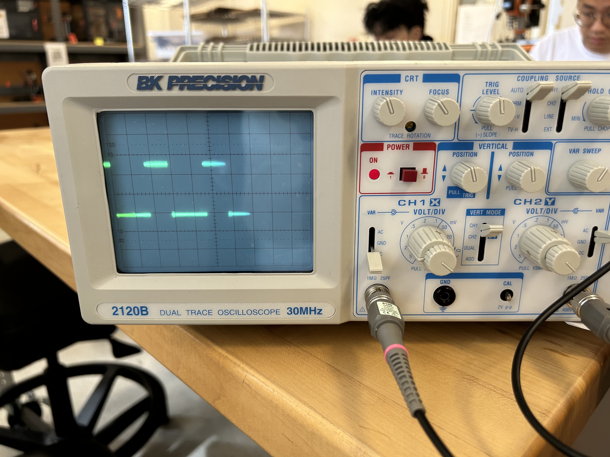
Pin 10 at PWM 200:
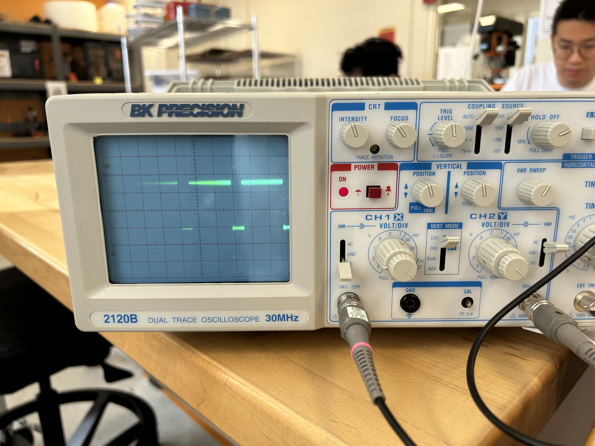
Pin 10 at PWM 200 while Pin 9 is on (ie. Pin 10 is off):
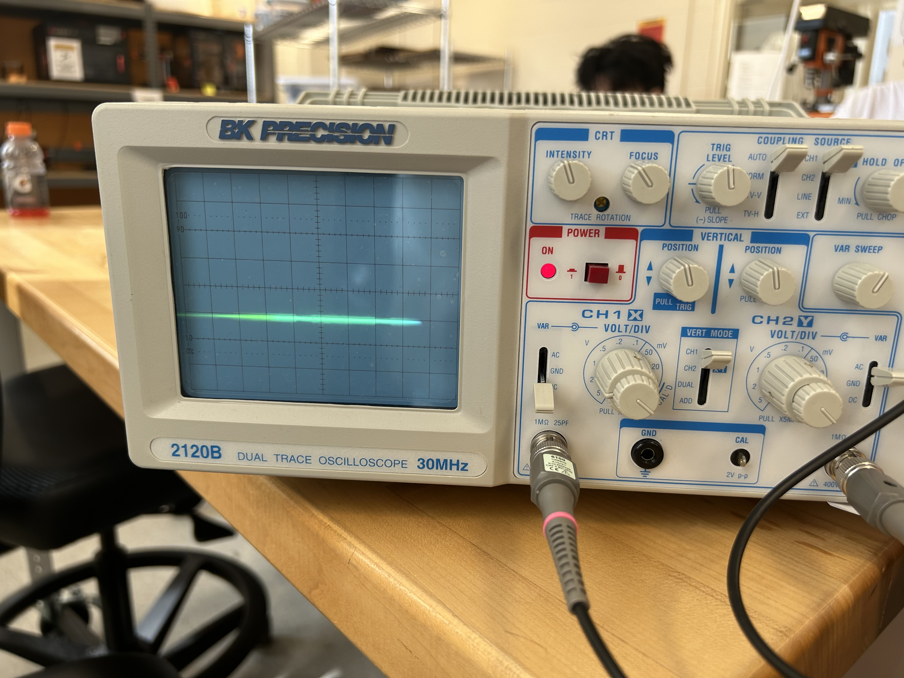
12V M+ and PWM 100:
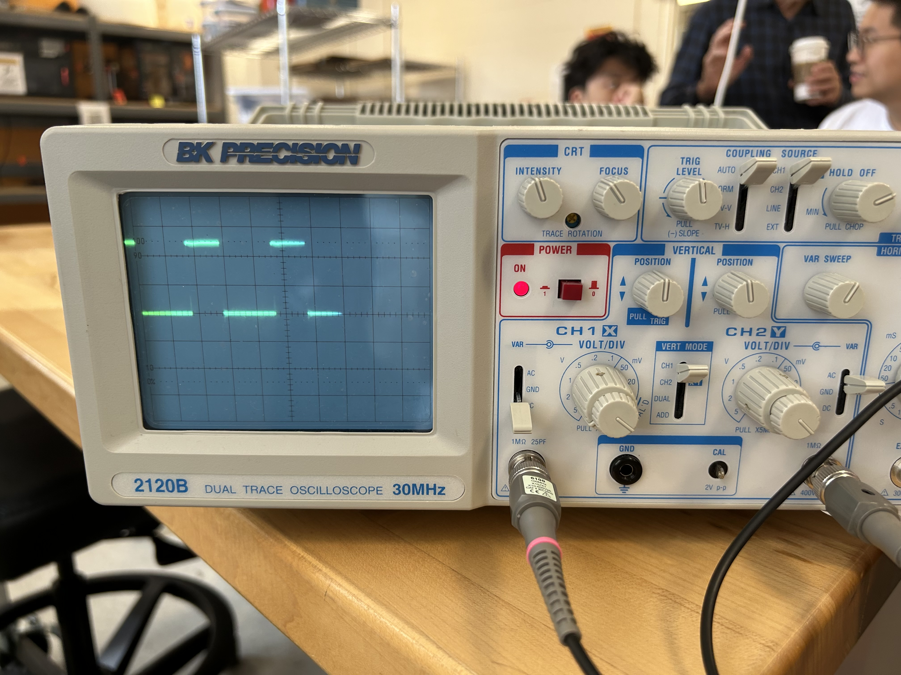