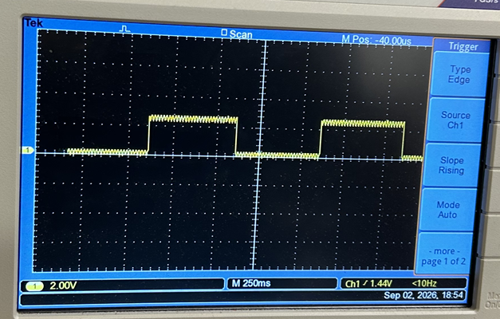
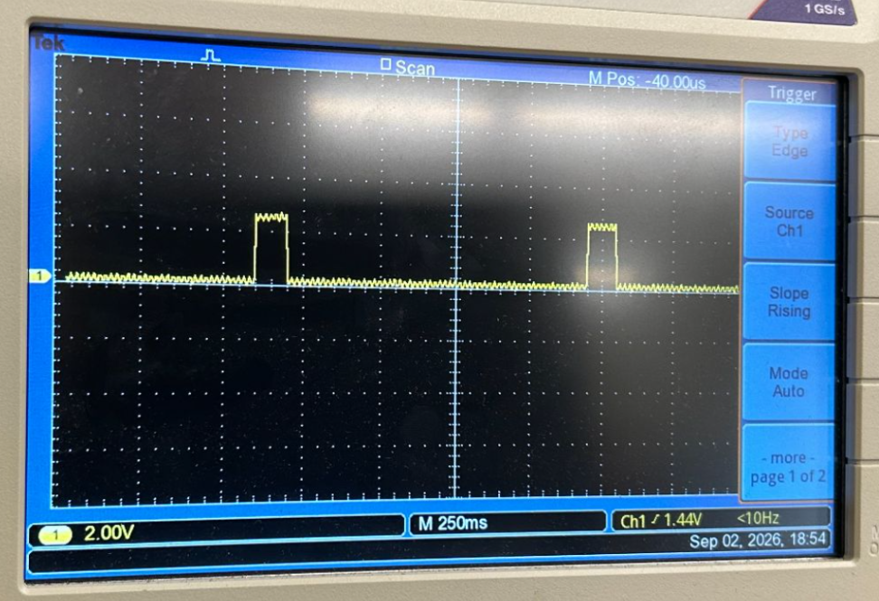
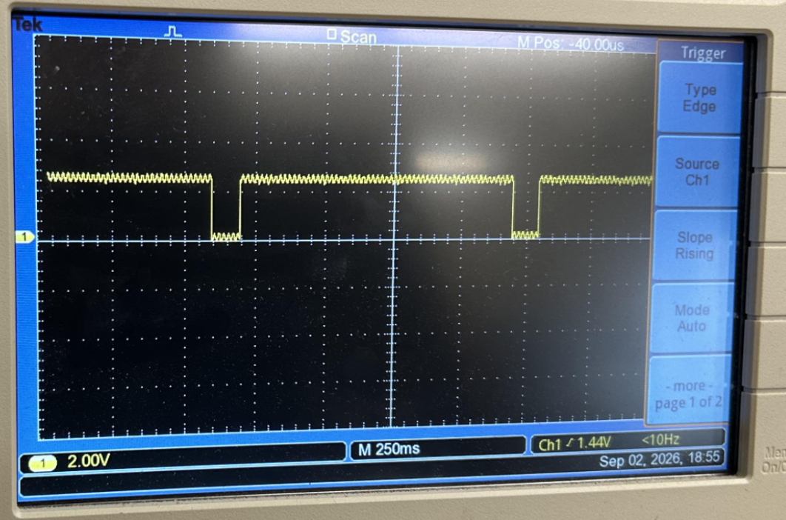
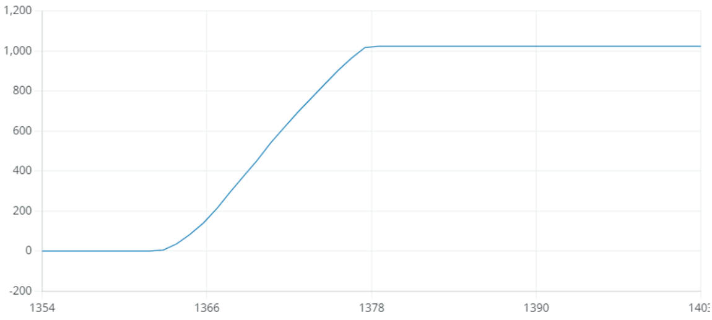
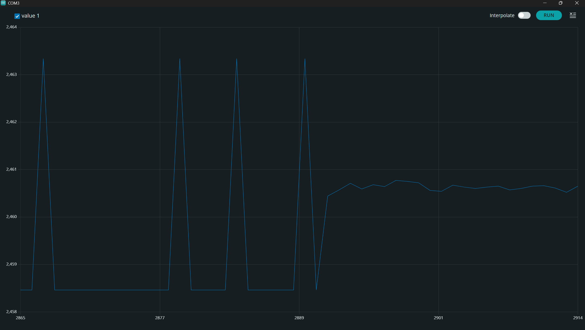
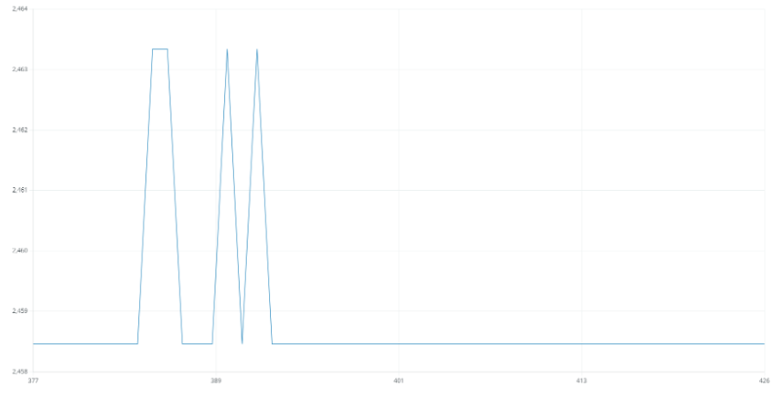
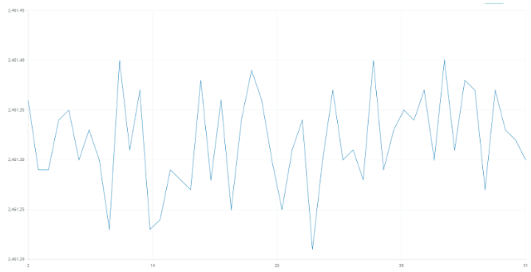
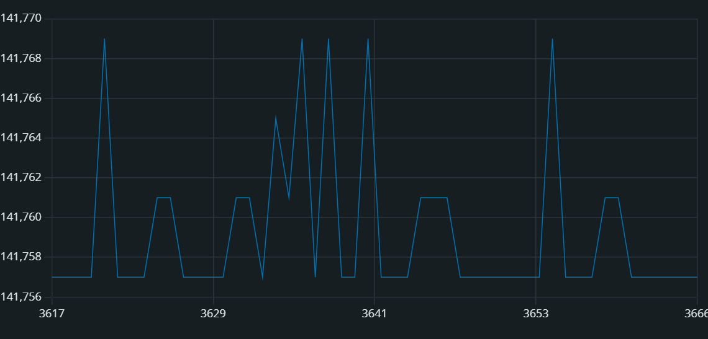
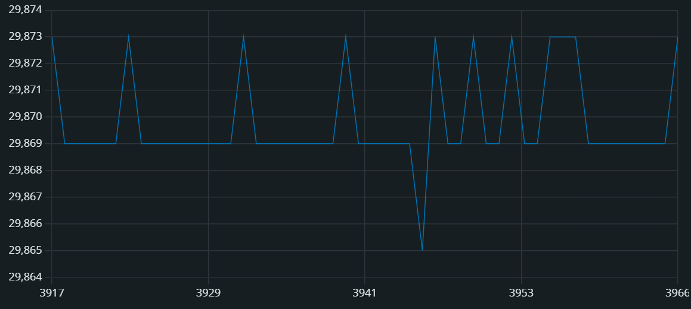

# Module 1 Assignment: First Contact With The Instrument CODE
## Part 1: Blink And Digital Output

1:1
* **High Voltage:** 2.5V
* **Low Voltage:** 0V
* **Period:** 1000ms
* **Frequency:** 1Hz
* **Duty Cycle:** 50%

1:10
* **High Voltage:** 2.5V
* **Low Voltage:** 0V
* **Period:** 1100ms
* **Frequency:** 0.91Hz
* **Duty Cycle:** 9.09%

10:1
* **High Voltage:** 2.5V
* **Low Voltage:** 0V
* **Period:** 1100ms
* **Frequency:** 0.91Hz
* **Duty Cycle:** 90.1%

## Part 2: AnalogReadSerial
Rotate the potentiometer and confirm that the reported ADC number responds. Part 3 develops this observation into a quantitative measurement of ADC digitization and averaging.
Use Analog, ADC, And PWM when you need the ideas behind the measurement.

## Part 3: Quantify The Power Of Averaging
### 3A: Observe The Integer ADC Readings

Do the reported values vary even when you do not touch the potentiometer?
Yes for some voltage, no for some others.
Do the values change continuously, or do they occupy discrete integer levels? Why?
The value changes on discrete integer level. Because the values range from 0V to 5V in 1024 steps.
What does Serial Monitor reveal that is difficult to see in Serial Plotter, and vice versa?
It is difficult to see the trend in serial monitor because the data flies too quickly, but it is easy to visualize in serial plotter. Serial plotter is not as good at looking at exact numerical value compared to serial monitor.

### 3B: Convert ADC Number To Voltage
#### Calculate this resolution in millivolts. For a 5.00 V reference it is about 4.88 mV. Explain why printing many decimal places does not, by itself, give the ADC finer physical resolution.
The resolution is not finer because the range from 0V to 5V is divided into 1024 points. Having more decimal places that are not significant figures does not help physical resolution, it is just a math artifact.

### 3C: Compare One Reading With A 1000-Reading Average
#### Print only one plotted voltage quantity per line. In Serial Monitor, also identify the point number and whether it came from.
Stop the plotter when the transition between an unaveraged block and a 1000-reading average block is approximately halfway across the graph, as in the figure below. Your numerical values and detailed trace need not look identical to the example. Save this screenshot and the corresponding numerical output.

(a) For each 100-point block, calculate the mean voltage and sample standard deviation. In this exercise, use as an empirical estimate of the noise-limited voltage resolution of the reported value. Compare the measured ratio with the independent-noise prediction

* 100 Data for no averaging:
2458.46 2458.46 2463.34 2458.46 2458.46 2458.46 2463.34 2458.46 2458.46 2458.46 2458.46 2458.46 2458.46 2458.46 2463.34 2458.46 2458.46 2458.46 2458.46 2458.46 2458.46 2463.34 2463.34 2458.46 2458.46 2458.46 2458.46 2463.34 2458.46 2463.34 2458.46 2458.46 2458.46 2458.46 2463.34 2458.46 2458.46 2458.46 2458.46 2458.46 2458.46 2458.46 2463.34 2458.46 2463.34 2458.46 2458.46 2458.46 2458.46 2458.46 2458.46 2463.34 2458.46 2458.46 2458.46 2458.46 2458.46 2458.46 2458.46 2458.46 2458.46 2463.34 2458.46 2458.46 2458.46 2458.46 2463.34 2458.46 2463.34 2458.46 2458.46 2458.46 2458.46 2458.46 2458.46 2458.46 2458.46 2458.46 2458.46 2458.46 2458.46 2458.46 2458.46 2458.46 2458.46 2458.46 2458.46 2458.46 2463.34 2458.46 2458.46 2458.46 2458.46 2463.34 2463.34 2458.46 2458.46 2458.46 2458.46 2458.46
* Mean of no averaging: 2459.29
* Std Dev of no averaging: 1.84

* 100 Data for 1000-point averaging block:
2461.32 2461.27 2461.31 2461.31 2461.36 2461.28 2461.27 2461.31 2461.35 2461.31 2461.35 2461.27 2461.3 2461.31 2461.27 2461.3 2461.35 2461.37 2461.47 2461.31 2461.35 2461.34 2461.43 2461.37 2461.31 2461.35 2461.19 2461.28 2461.26 2461.2 2461.22 2461.25 2461.18 2461.21 2461.15 2461.3 2461.11 2461.24 2461.16 2461.23 2461.22 2461.31 2461.22 2461.17 2461.25 2461.14 2461.23 2461.2 2461.18 2461.22 2461.08 2461.25 2461.23 2461.26 2461.36 2461.24 2461.14 2461.34 2461.21 2461.2 2461.19 2461.22 2461.41 2461.32 2461.32 2461.24 2461.36 2461.24 2461.16 2461.26 2461.18 2461.31 2461.14 2461.22 2461.23 2461.05 2461.26 2461.2 2461.25 2461.24 2461.33 2461.14 2461.27 2461.19 2461.13 2461.31 2461.33 2461.15 2461.31 2461.21 2461.22 2461.35 2461.27 2461.12 2461.3 2461.16 2461.17 2461.23 2461.14 2461.26
* Mean of 1000 point averaging: 2461.25 
*Std Dev of 1000 point averaging: 0.078
The 1000 point average is about 25 times better than the no averaging data.

(b) A second way to measure the effective resolution in millivolts for the unaveraged and averaged blocks is by looking at the smallest discrete voltage jump between two subsequent data points. Compare the unaveraged smallest discrete voltage jump between two subsequent data points with the ADC's fixed one-count digitization step.
Smallest discrete data jump: 0.02mV
Explain likely departures from the 1/sqrt(N) prediction, including drift, correlated pickup, quantization, and variation of the Arduino reference voltage. Averaging improves precision under these conditions, but it does not automatically improve absolute accuracy or remove calibration errors.

### 3D: Measure The Time Cost Of Averaging
#### Explain the tradeoff. Averaging over a finite interval acts as a low-pass filter: rapid fluctuations tend to cancel, but changes occurring during the averaging window are smoothed or delayed. Improved voltage precision therefore comes with reduced time resolution.
1000-Reading Average Time Interval:

No Averaging Time Interval:

The graphs above shows the time in microseconds in the y-axis and it represents the amount of time it takes for the code to run through the for loop once. We can see that for the no averaging, on average, it takes about 29,869 microseconds for the code to run through one for loop, however, with 1000-point averaging, it takes, on average, about  141,763 microseconds for the code to run through one for loop. This is a significant difference in time and the 1000-point averaging takes 4.7 times longer than the no averaging code to obtain one data point. 

## Part 4: LED Brightness From Averaged Analog Input
#### Record the PWM high and low voltages, period, frequency, and duty cycle at two substantially different potentiometer settings.  

#### Determine which quantities change and which remain approximately fixed. If you use Arduino Uno pin 9, compare the measured frequency with the expected value of approximately 490 Hz. Compare this with the roughly 50-60 Hz range above which ordinary flicker often appears steady to the eye. 
Quantities like the maximum voltage and minimum voltage stays the same but the duty cycle, frequency, and period changes depending on where the potentiometer’s shaft is. The measured frequency is 500 Hz, which was obtained by the fact that we had 1 period per 2ms. The inverse of  2ms = 500 Hz. Compared to the expected value of 490 Hz, 500 Hz is very close as there is only a ~2% error. Compared to the 50~60 Hz range for ordinary flicker, the frequency 10 times of that. 

#### Explain why the LED looks continuously lit even though the oscilloscope resolves individual pulses.
The LED looks continuously lit even though the oscilloscope resolves individual pulses because it is pulsing at such a fast time scale that our eyes can’t process the flickering individually like in the first part of the lab, and so instead, we see a dimming LED. 
